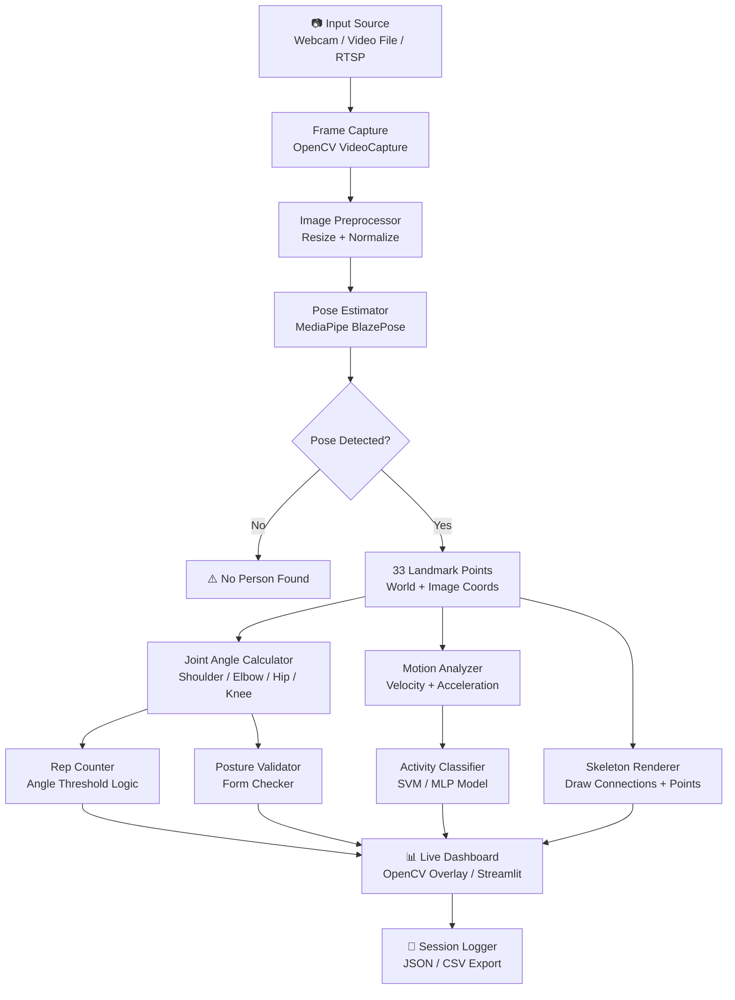

# 🏃 Body Tracker

A real-time body pose tracking and motion analysis system using computer vision. Detects and tracks 33 full-body landmarks, calculates joint angles, and provides live analytics for fitness, sports, and rehabilitation applications.

## 🏗️ Architecture



##  Features

- 33-point full-body landmark detection at 30+ FPS
- Joint angle calculation for all major joints
- Exercise rep counting with form validation
- Posture analysis and correction alerts
- Activity classification (squat, pushup, curl, etc.)
- Real-time overlay visualization
- Session recording and playback
- CSV/JSON data export for analysis
- RTSP stream support for IP cameras

## 🛠️ Tech Stack

| Layer | Technology |
|-------|-----------|
| Language | Python 3.10+ |
| Pose Estimation | MediaPipe BlazePose |
| Computer Vision | OpenCV 4.x |
| Numerical Analysis | NumPy, SciPy |
| Classification | scikit-learn |
| Visualization | OpenCV GUI, Matplotlib |
| Data Export | Pandas, JSON |
| UI (optional) | Streamlit |

##  How to Run

```bash
# 1. Clone and install
git clone https://github.com/jadfarhat-cell/body-tracker.git
cd body-tracker
pip install -r requirements.txt

# 2. Run with webcam (default)
python tracker.py

# 3. Run on a video file
python tracker.py --input workout.mp4 --output tracked.mp4

# 4. Run specific exercise counter
python tracker.py --exercise squat
python tracker.py --exercise pushup
python tracker.py --exercise curl

# 5. Run Streamlit analytics dashboard
streamlit run dashboard.py

# 6. Export session data
python tracker.py --export-csv session_data.csv
```

## 📁 Project Structure

```
body-tracker/
├── tracker.py              # Main tracking script
├── dashboard.py            # Streamlit dashboard
├── modules/
│   ├── pose_detector.py    # MediaPipe wrapper
│   ├── angle_calculator.py # Joint angle math
│   ├── rep_counter.py      # Exercise rep logic
│   ├── form_checker.py     # Posture validation
│   ├── classifier.py       # Activity recognition
│   └── renderer.py         # Visualization
├── models/
│   └── activity_classifier.pkl
├── data/
│   └── sessions/           # Saved session data
├── requirements.txt
└── config.yaml
```
